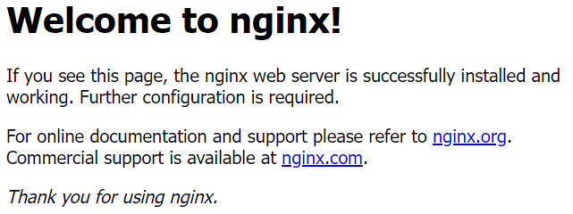

- Utilisation de Docker
- ```bash
  docker run hello-world
  docker run -d -p 80:80 docker/getting-started
  ```
- Tutoriel suivi : https://supports.uptime-formation.fr/04-docker/1_tp_manipulation-de-conteneurs/
- Lancement de 2 containers nginx
  ```bash
  docker run -d -p 8080:80 --name "test2_nginx" nginx # la syntaxe est : port_hote:port_container
  docker run -d -p 8081:80 --name "test3_nginx" nginx
  ```
- 
-
- ## Jellysmack Development Workflow (Malo)
- Plan
	- Jira Software
- Code
	- VS Code
	- Docker
	- Git
		- Gitmoji
		- feat! : Conventional commit
	- pytest
- Build
	- docker -> AmazonECR -> argo -> kubernetes
	- GitLab
		- Linter : vérifier le respect des conventions de l'entreprise
- Test
	- Environnement éphémère
		- Permet un premier test d'intégration côté frontend
	- Environnement préproduction
- Release
	- Terraform
	- aws
	- Déclarer ses variables d'environnement dans sa stack ArgoCD
- Deploy
	- AmazonECR -> argo -> kubernetes
	- Route versioning investigation
- Operate
	- Hotfix : rétablir le bon fonctionnement au plus vite
- Monitor
	- Amazon CloudWatch
	- Datadog
- Communication
	- Google Meet
	- Slack
	- Notion